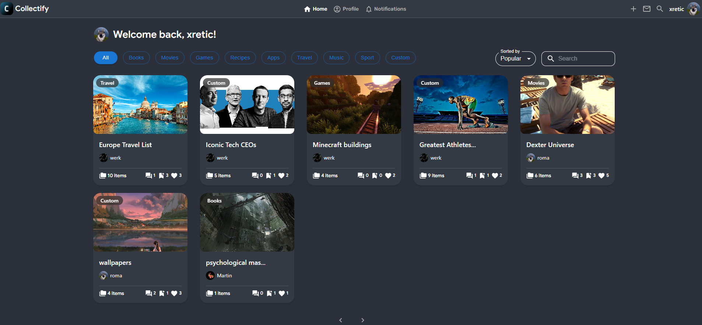
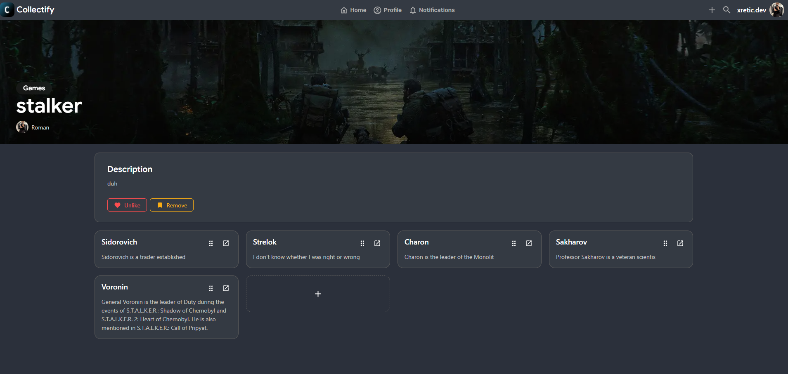
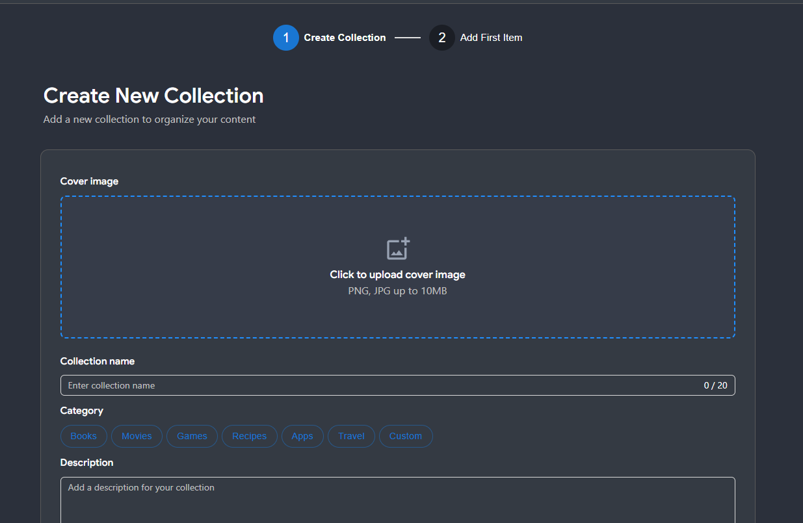
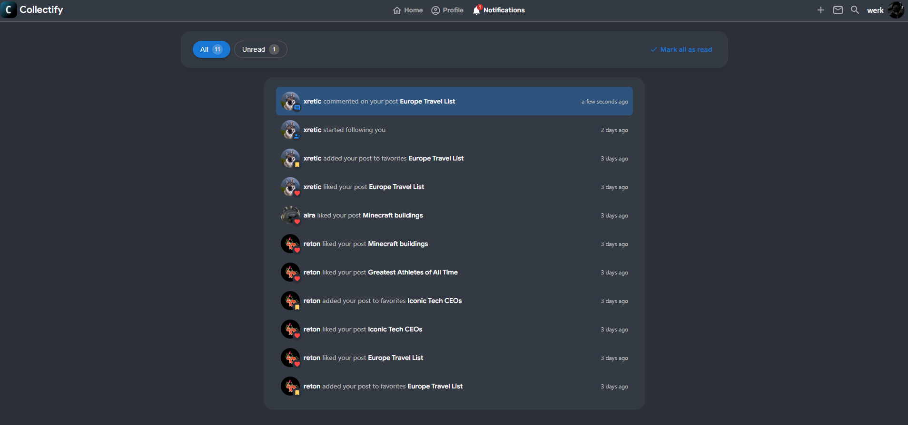

# Collectify

Collectify is a full-stack web application for creating, managing, and sharing collections of items.

---

## Core Features

### Collections & Items

- Create collections with predefined and custom categories
- Add, update, delete, and reorder items inside a collection
- Support for extensible item metadata (title, description, optional fields)

### Social Layer

- Like collections
- Add collections to favorites
- Follow users
- Notification system for social interactions (likes, favorites, follows)

### Discovery

- Home feed with pagination
- Sorting (popular, newest, etc.)
- Category filtering
- Search

---

## Screenshots

### Home Feed



### Collection Page



### Notifications



### Notifications



---

## Architecture Overview

The application follows a **modular, feature-oriented architecture** built on top of Next.js App Router.

### High-level Flow

---

## Tech Stack

### Frontend

- **Next.js (App Router)**
- **TypeScript**
- **MUI** + **Ant Design**
- **Zustand** (global client state)
- **dnd-kit** (drag & drop item ordering)

### Backend

- **Next.js Route Handlers**
- **Prisma ORM**
- **PostgreSQL**
- Server-side validation and authorization

### Infrastructure

- Environment-based configuration
- Ready for deployment on **Vercel**

---

## Getting Started

### Prerequisites

- Node.js ≥ 18
- PostgreSQL

### Installation

```bash
git clone https://github.com/xretic/collectify.git
cd collectify
npm install
npm run dev
```
