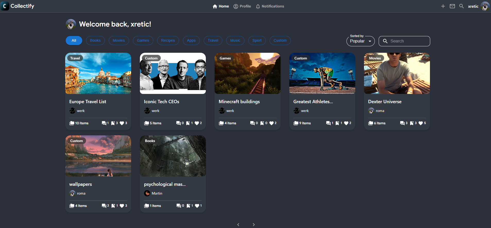
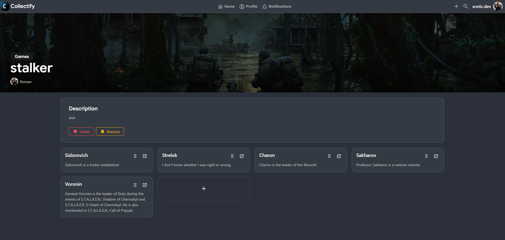
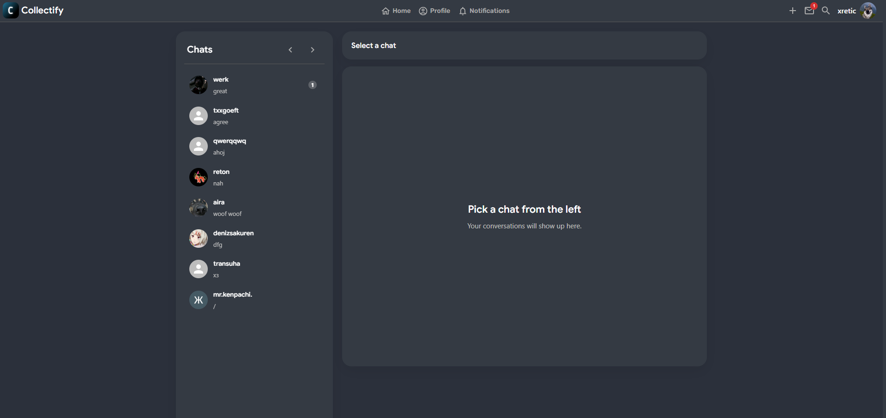
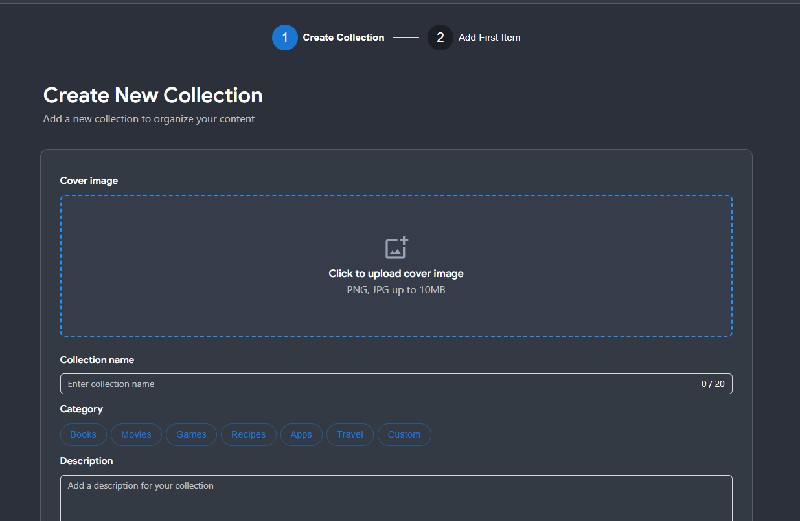
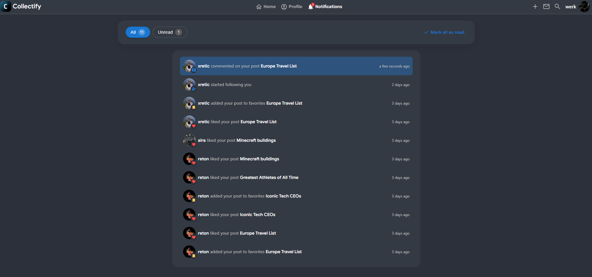

### Collectify

Collectify is a full-stack web application for creating, managing, and
sharing collections of items.

---

### Collections & Items

- Create collections with predefined and custom categories
- Add, update, delete, and reorder items inside a collection
- Support for extensible item metadata (title, description, optional
  fields)
- Messenger with WebSocket

### Social Layer

- Like collections
- Add collections to favorites
- Follow users
- Notification system for social interactions (likes, favorites,
  follows)

### Discovery

- Home feed with pagination
- Sorting (popular, newest, etc.)
- Category filtering
- Search

---

## Screenshots

### Home Feed



### Collection Page



### Chats



### Collection Create



### Notifications



---

### Architecture Overview

The application follows a modular, feature-oriented architecture built
on top of Next.js App Router.

High-level Flow

---

### Tech Stack

### Frontend

- Next.js
- TypeScript
- MUI + Ant Design
- Zustand
- dnd-kit
- TanStack Query

### Backend

- Next.js Route Handlers
- Prisma ORM
- PostgreSQL
- Redis

### Infrastructure

- Environment-based configuration
- Ready for deployment on Vercel

---

### Getting Started

### Prerequisites

```bash
- Node.js ≥ 20.9
- PostgreSQL
```

### Installation

```bash
git clone https://github.com/xretic/collectify.git cd collectify
npm install
npm run dev
```

---

### Realtime Chat

Real-time chat is served by the application itself. `npm run dev` and
`npm run start` run `server.mjs`, which starts Next.js and Socket.IO on the
same origin at `/socketio`.

On Vercel, custom Socket.IO servers are not used by the platform runtime. Set
these Pusher Channels variables in Vercel instead:

```bash
PUSHER_APP_ID=
PUSHER_SECRET=
NEXT_PUBLIC_PUSHER_KEY=
NEXT_PUBLIC_PUSHER_CLUSTER=
```

The client automatically uses Pusher when `NEXT_PUBLIC_PUSHER_KEY` and
`NEXT_PUBLIC_PUSHER_CLUSTER` exist. Otherwise it uses local Socket.IO.
