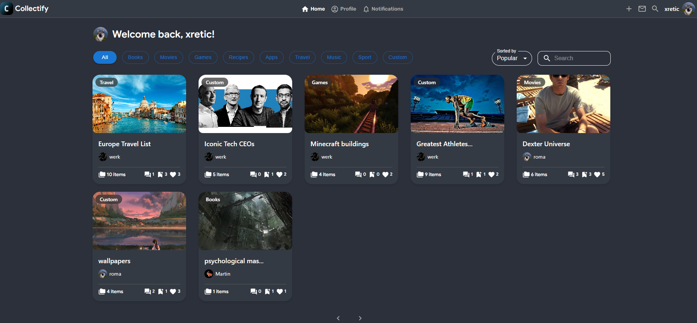
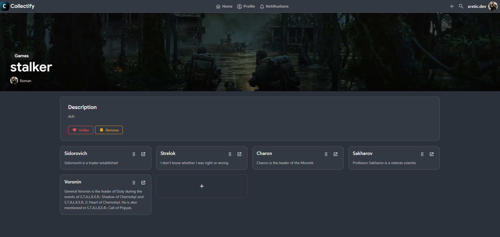
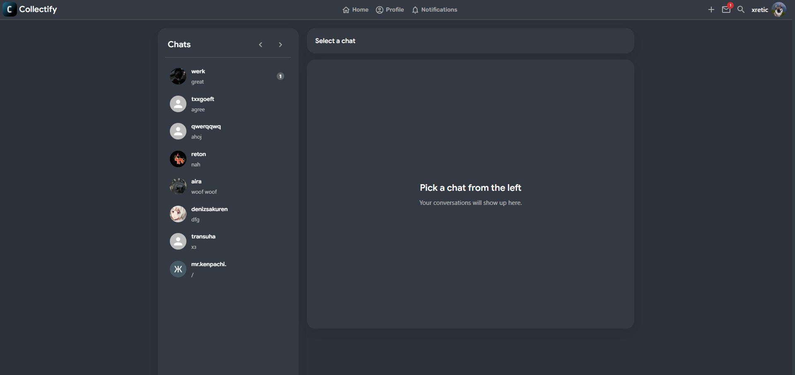
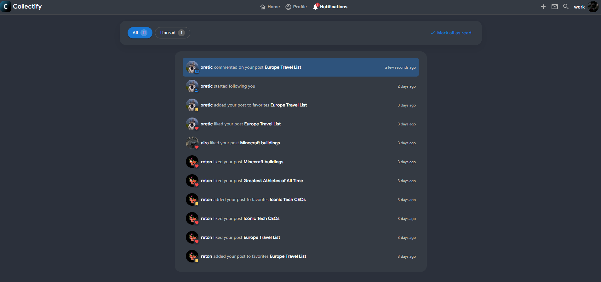

# Collectify

Collectify is a full-stack web application for creating, managing, and sharing collections of items.

## Features

**Collections & items**

- Collections with admin-managed categories and up to 10 user-created tags, public or private
- Pinterest-like masonry of items in four sizes (S/M/L/XL); an item needs a title or an image
- Drag-and-drop reordering, item viewer, likes, saves, threaded comments, per-collection statistics

**Discovery**

- "For you" feed ranked by tags/categories of what you like, save and open, plus who you follow
- Boards: group saved collections; each board gets a "more like this" feed on the home page
- Explore feed with category menu, tag filter, search and sorting (state lives in the URL)
- Tag search ranks what you typed first, then popularity; empty query shows the category's top tags
- Sign-up onboarding: pick interesting categories (covers are random popular collections)

**Social**

- Follow users (followers / following lists), "People you may know" (friends of friends, same city, followers)
- Comments with replies, "(edited)" marks and the collection author's heart
- Realtime direct messages and notifications with live pop-ups (Socket.IO or Pusher)
- Optional profile location and date of birth (18+)

**Moderation**

- Reports on users, comments and collections, with an evidence snapshot
- FIFO review queue with context (prior reports, active sanctions)
- Atomic report review: sanctions never weaken a stronger one, duplicates close together
- Sanctions (account ban, comments/messenger mute), roles, audit log, impersonation
- Admin management of categories and removal of spam tags

**Appearance**

- 20+ color themes in the spirit of monkeytype; every color is a theme token (`app/themes.css`)

## Screenshots

| Home feed                                      | Collection                                                 |
| ---------------------------------------------- | ---------------------------------------------------------- |
|  |  |

| Chats                                  | Notifications                                          |
| -------------------------------------- | ------------------------------------------------------ |
|  |  |

## Architecture

The code follows [Feature-Sliced Design](https://feature-sliced.design); a layer may import only from
layers below it.

| Layer       | Contents                                                                                  |
| ----------- | ----------------------------------------------------------------------------------------- |
| `app/`      | Next.js routing only: pages, layouts, thin API route handlers                             |
| `views/`    | Page compositions                                                                         |
| `widgets/`  | Large self-contained blocks (navbar, chat window, comments section…)                      |
| `features/` | User actions: UI + `server/` services (report review, sanctions, follow…)                 |
| `entities/` | Domain models, DTO types, client `api/`, server `server/` queries, presentational `ui/`   |
| `shared/`   | Framework glue: `server/` (db, http, rate limit, cache), UI primitives, validation, theme |

Conventions:

- Every API route is `route(handler)` + a zod schema (`readBody`/`readQuery`) + a service call.
  Errors are thrown as `ApiError` and mapped to JSON responses.
- Server-only modules start with `import 'server-only'`.
- Styles live in the component's `index.module.css`. One MUI theme (`shared/config/theme.ts`)
  holds global component overrides; colours are theme tokens from `app/themes.css`.
  No style objects in `.tsx` files.
- Server state is React Query; zustand is used only for tiny cross-tree UI state.

## Tech stack

Next.js 16 (App Router, custom server) · React 19 · TypeScript · MUI 7 · TanStack Query ·
zustand · zod · Prisma 7 (Neon) · Redis (Upstash or ioredis) · Socket.IO / Pusher ·
dnd-kit

## Getting started

Requirements: Node.js ≥ 20.9, a Neon database.

```bash
git clone https://github.com/xretic/collectify.git
cd collectify
cp .env.example .env   # fill in DATABASE_URL at least
npm install
npm run db:migrate
npm run dev
```

Grant yourself admin rights (there is intentionally no HTTP endpoint for this):

```bash
npm run admin -- grant <username|id>
```

## Scripts

| Script                    | What it does                                     |
| ------------------------- | ------------------------------------------------ |
| `npm run dev`             | Next.js + Socket.IO on one origin (`server.mjs`) |
| `npm run build` / `start` | Production build / server                        |
| `npm run lint`            | ESLint                                           |
| `npm run typecheck`       | Route types + `tsc`                              |
| `npm run format:check`    | Prettier                                         |
| `npm run db:migrate`      | Apply migrations (`prisma migrate deploy`)       |
| `npm run admin`           | Grant / revoke / list admins                     |

## Realtime

`npm run dev` and `npm start` run `server.mjs`, which serves Next.js and Socket.IO on the same
origin (`/socketio`). Sockets authenticate with the session cookie directly against the database.

On Vercel the custom server is not used — set the `PUSHER_*` / `NEXT_PUBLIC_PUSHER_*` variables and
the client switches to Pusher automatically.

Events are typed per slice via declaration merging on `RealtimeEvents`
(`shared/lib/realtime/events.ts`): chat messages and notifications (`notification:new`,
`notification:removed`).
