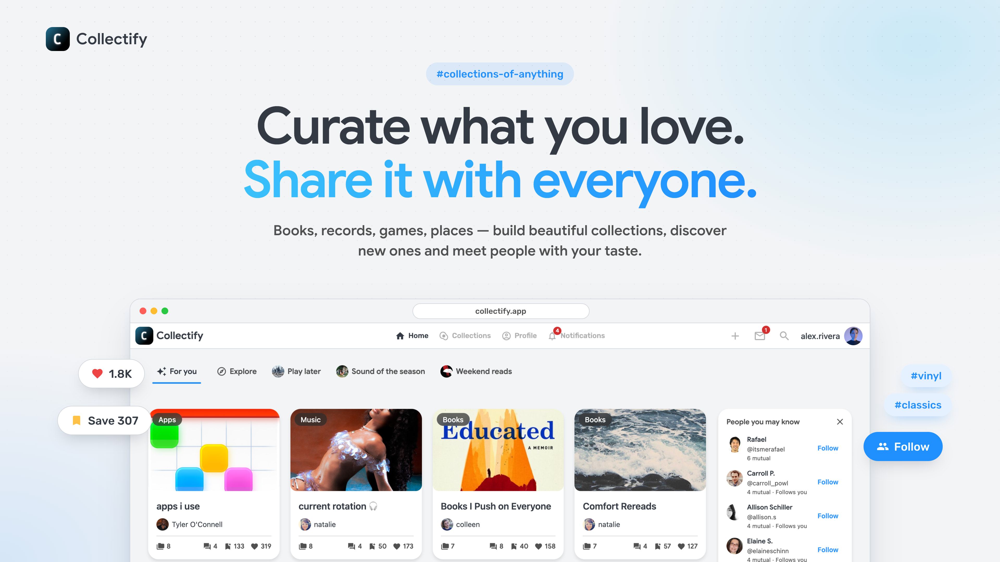
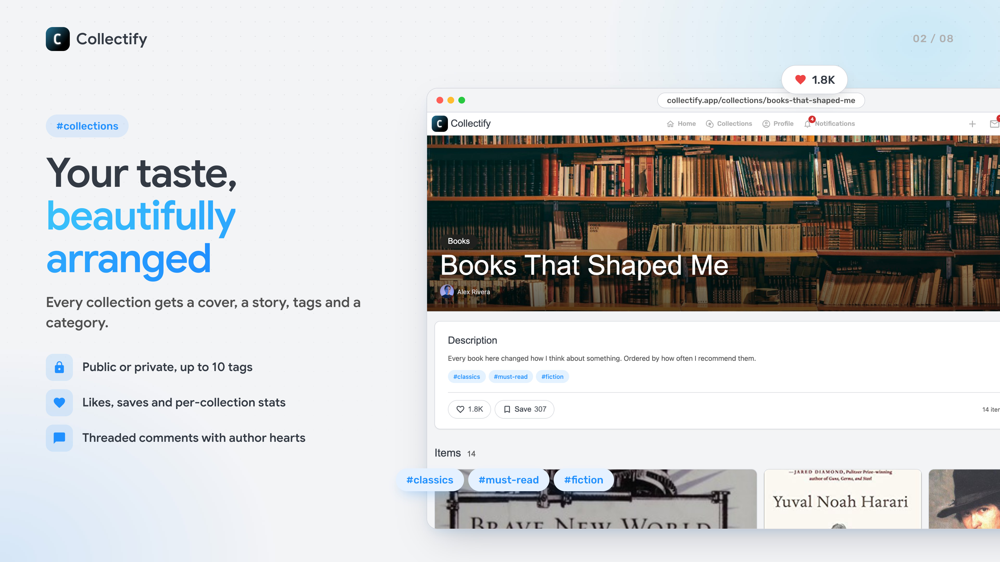
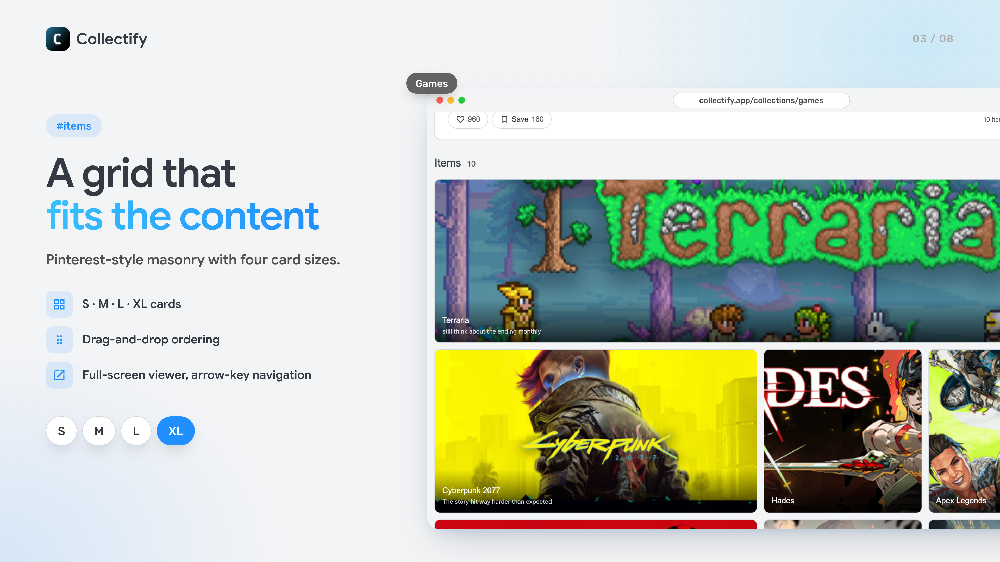
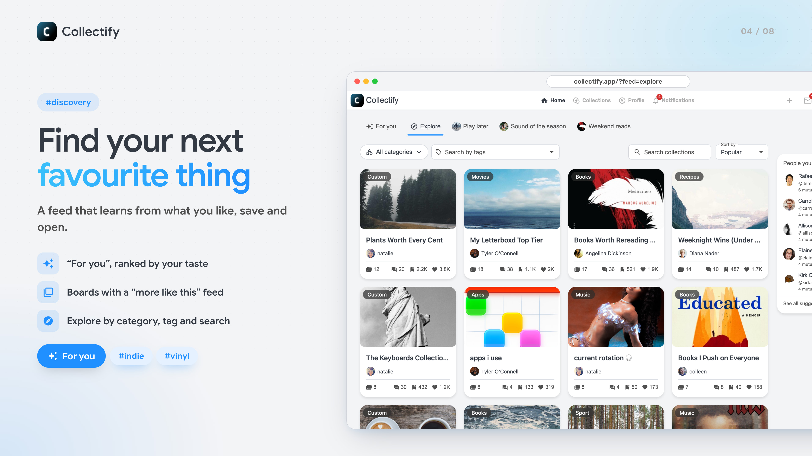
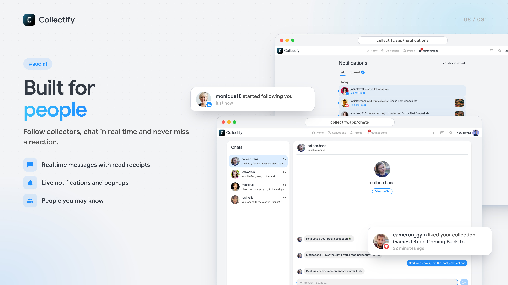
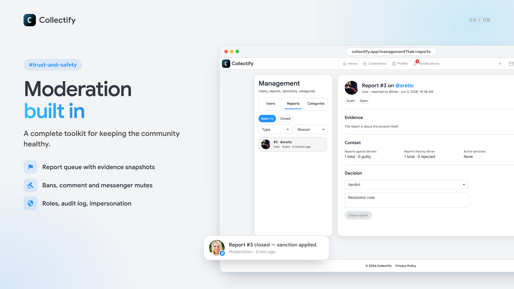
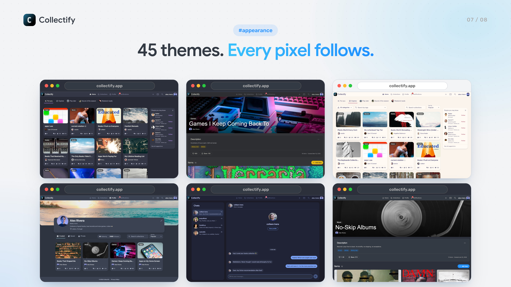
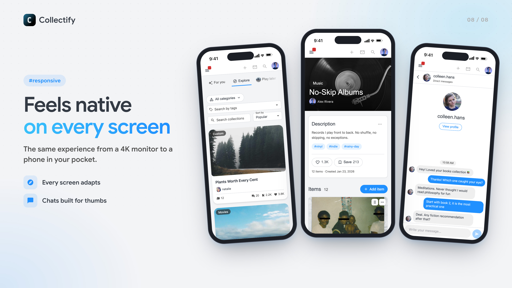

<div align="center">


# Collectify

**Curate what you love. Share it with everyone.**

A full-stack social platform for building, discovering and discussing collections of anything —
books, records, games, places, gear.

[](https://nextjs.org)
[](https://react.dev)
[](https://www.typescriptlang.org)
[](https://www.prisma.io)
[](https://neon.tech)
[](https://mui.com)
<br />
[](https://github.com/xretic/collectify/stargazers)
[](https://github.com/xretic/collectify/commits/main)
[](LICENSE)
[](CONTRIBUTING.md)

[**Features**](#-features) · [**Quick start**](#-quick-start) · [**Architecture**](docs/ARCHITECTURE.md) ·
[**Deployment**](docs/DEPLOYMENT.md) · [**Contributing**](CONTRIBUTING.md)

<br />



</div>

<br />

## ✨ Features

<table>
<tr>
<td width="58%">



</td>
<td width="42%" valign="middle">

### 📚 Collections

Every collection gets a cover, a story, a category and tags.

- Public or private
- Up to **10 tags** per collection
- Likes, saves and per-collection statistics
- Threaded comments with replies and author hearts

</td>
</tr>
<tr>
<td width="42%" valign="middle">

### 🧱 Items

A Pinterest-style masonry grid that adapts to the content.

- Four card sizes: **S · M · L · XL**
- Drag-and-drop ordering
- Image, title, note and source link per item
- Full-screen viewer with arrow-key navigation

</td>
<td width="58%">



</td>
</tr>
<tr>
<td width="58%">



</td>
<td width="42%" valign="middle">

### 🧭 Discovery

A feed that learns from what you like, save and open.

- **For you** — ranked by tags, categories, follows, popularity and freshness
- **Boards** of saved collections, each with a "more like this" feed
- **Explore** by category, tag, search and sort — all in the URL
- Onboarding seeds the feed with your interests

</td>
</tr>
<tr>
<td width="42%" valign="middle">

### 💬 Social

Follow collectors, chat in real time and never miss a reaction.

- Realtime direct messages with read receipts, presence and mute
- Live notifications and pop-ups (Socket.IO or Pusher)
- **People you may know**: mutuals, same city, followers
- Followers and following lists

</td>
<td width="58%">



</td>
</tr>
<tr>
<td width="58%">



</td>
<td width="42%" valign="middle">

### 🛡️ Trust & safety

A complete moderation toolkit at `/management`.

- Reports on users, comments and collections with evidence snapshots
- FIFO review queue with context and atomic verdicts
- Sanctions: account bans, comment and messenger mutes
- Roles, audit log, impersonation, category and tag management

</td>
</tr>
</table>

<table>
<tr>
<td width="50%" valign="top">

### 🎨 45 themes

Every color in the UI is a theme token from [`app/themes.css`](app/themes.css) — light, dark,
Dracula, Nord, Tokyo Night, Rosé Pine and many more. The saved theme applies before first paint.



</td>
<td width="50%" valign="top">

### 📱 Responsive

The same experience from a 4K monitor to a phone: every screen, including chats and moderation,
adapts to small viewports.



</td>
</tr>
</table>

## 🚀 Quick start

**Prerequisites:** Node.js ≥ 20.9 and a [Neon](https://neon.tech) Postgres database.

```bash
git clone https://github.com/xretic/collectify.git
cd collectify
cp .env.example .env        # set DATABASE_URL and DIRECT_URL at least
npm install
npm run db:migrate
npm run dev                 # http://localhost:3000
```

Grant yourself admin rights — there is intentionally no HTTP endpoint for this:

```bash
npm run admin -- grant <username|id>
```

See [Deployment](docs/DEPLOYMENT.md) for every environment variable, OAuth, Redis and realtime options.

## 🧱 Tech stack

| Layer     | Technology                                                              |
| --------- | ----------------------------------------------------------------------- |
| Framework | Next.js 16 (App Router, custom server) · React 19 · TypeScript          |
| UI        | MUI 7 · CSS Modules · dnd-kit · Recharts · 45 CSS-token themes          |
| State     | TanStack Query (server state) · zustand (tiny UI state) · zod           |
| Data      | Prisma 7 · Neon Postgres (triggers, trigram indexes, keyset pagination) |
| Infra     | Redis (Upstash or ioredis) for cache and rate limits                    |
| Realtime  | Socket.IO on the custom server · Pusher on Vercel                       |

## 🏗️ Architecture

The codebase follows [Feature-Sliced Design](https://feature-sliced.design) — a layer imports only
from layers below it.

```text
app/        Next.js routing only: pages, layouts, thin API route handlers
views/      Page compositions
widgets/    Large self-contained blocks (navbar, chat window, comments…)
features/   User actions: UI + server services (report review, sanctions, follow…)
entities/   Domain models, DTOs, client api/, server queries, presentational ui/
shared/     Framework glue: db, http, rate limit, cache, UI primitives, validation, theme
```

Every API route is `route(handler)` + a zod schema + a service call; errors are thrown as `ApiError`
and mapped to JSON. Read the [architecture guide](docs/ARCHITECTURE.md) for the request lifecycle,
data model, recommendation ranking, realtime and security model.

## 📜 Scripts

| Script                    | Description                                      |
| ------------------------- | ------------------------------------------------ |
| `npm run dev`             | Next.js + Socket.IO on one origin (`server.mjs`) |
| `npm run build` / `start` | Production build / server                        |
| `npm run lint`            | ESLint                                           |
| `npm run typecheck`       | Route types + `tsc --noEmit`                     |
| `npm run format:check`    | Prettier                                         |
| `npm run i18n:check`      | Verify translations against `en.json`            |
| `npm run db:migrate`      | Apply migrations (`prisma migrate deploy`)       |
| `npm run admin`           | Grant / revoke / list admins                     |

## 📖 Documentation

| Guide                                | What's inside                                            |
| ------------------------------------ | -------------------------------------------------------- |
| [Architecture](docs/ARCHITECTURE.md) | Layers, request lifecycle, data model, realtime, ranking |
| [Deployment](docs/DEPLOYMENT.md)     | Environment variables, Vercel vs. custom server, Redis   |
| [Contributing](CONTRIBUTING.md)      | Workflow, conventions and pull request checklist         |
| [Security policy](SECURITY.md)       | How to report a vulnerability                            |

## 🤝 Contributing

Contributions are welcome! Please read the [contributing guide](CONTRIBUTING.md) and the
[code of conduct](CODE_OF_CONDUCT.md) before opening a pull request.

## 📄 License

Collectify is **source-available, not open source**. You may read the code and run it on your own
machine for personal, educational and evaluation purposes. Commercial use, public deployment and
redistribution are not permitted without a separate license. See [LICENSE](LICENSE) for the full
terms.

<div align="center">
<br />
<sub>Built with ❤️ by <a href="https://github.com/xretic">@xretic</a></sub>
</div>
