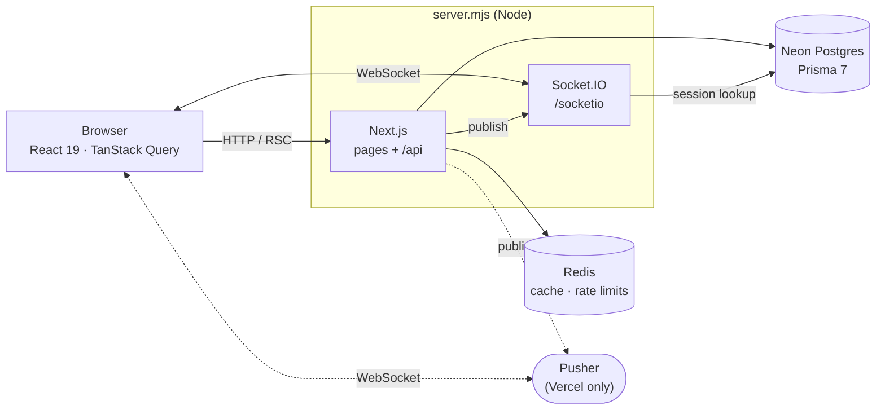
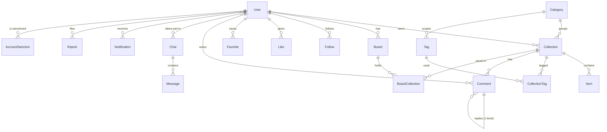

# Architecture

- [Overview](#overview)
- [Layers](#layers)
- [Request lifecycle](#request-lifecycle)
- [Data model](#data-model)
- [Recommendations](#recommendations)
- [Realtime](#realtime)
- [Caching and rate limiting](#caching-and-rate-limiting)
- [Security](#security)
- [Frontend conventions](#frontend-conventions)

## Overview

Collectify is a single Next.js 16 application (App Router) backed by Postgres on Neon. The same
process serves pages, the JSON API and — outside Vercel — a Socket.IO server.



## Layers

The code follows [Feature-Sliced Design](https://feature-sliced.design). A layer may import only
from the layers below it; slices on the same layer do not import each other.

```text
app ─▶ views ─▶ widgets ─▶ features ─▶ entities ─▶ shared
```

| Layer       | Contents                                                                                 | Examples                                         |
| ----------- | ---------------------------------------------------------------------------------------- | ------------------------------------------------ |
| `app/`      | Next.js routing only: pages, layouts, thin API route handlers, themes                    | `app/api/collections/[id]/like/route.ts`         |
| `views/`    | Page compositions                                                                        | `views/collection-details`, `views/management`   |
| `widgets/`  | Large self-contained blocks                                                              | `widgets/chat-window`, `widgets/collection-items` |
| `features/` | User actions: UI + `server/` services                                                    | `features/moderation`, `features/collection`     |
| `entities/` | Domain models, DTO types, client `api/`, server `server/` queries, presentational `ui/` | `entities/collection`, `entities/user`           |
| `shared/`   | Framework glue: `server/` (db, http, rate limit, cache), UI primitives, validation      | `shared/server/http.ts`, `shared/ui`             |

Inside a slice, segments are conventional: `model/` (types, hooks, zod schemas), `api/` (client
calls), `server/` (server-only code), `ui/` (components with a sibling `index.module.css`).

## Request lifecycle

Every API route has the same shape: guard → rate limit → validate → service → response.

```ts
// app/api/collections/[id]/like/route.ts
export const PUT = route<{ id: string }>(async (req, params) => {
    const viewer = await requireViewer(req); // 401 without a valid session
    await enforceRateLimit(req, 'mutation', viewer.userId); // 429 when exceeded

    await engage('LIKE', parseId(params.id), viewer.userId); // features/collection/server
    return noContent();
});
```

- `route()` (`shared/server/http.ts`) catches `ApiError` and maps it to a JSON error response;
  anything else becomes a logged 500.
- `readBody` / `readQuery` parse input with zod schemas from the slice's `model/`.
- Guards (`features/auth/server/guards.ts`): `requireViewer`, `requireChatViewer` (checks messenger
  mutes), `requireStaff` and `assertCanModerate` for management endpoints.
- Server-only modules start with `import 'server-only'`, so they can never leak into a client
  bundle.

On the client, server state lives in TanStack Query; each entity's `api/` exposes typed calls
built on `ky`, and hooks in `model/` wrap them in queries and mutations.

## Data model

The full schema is in [`prisma/schema.prisma`](../prisma/schema.prisma). The core relations:



Notable details:

- **Denormalised counters** — `Collection.likeCount` and `Tag.usageCount` are maintained by
  database triggers, so feeds sort by popularity through an index instead of counting rows.
- **Trigram indexes** (`pg_trgm`) back user, email and tag search.
- **Keyset pagination** on follows (`@@id([followerId, followingId])` plus the reverse index).
- **One chat per pair** — `Chat.pairKey = "<smallerId>:<biggerId>"` is unique.
- **Idempotent reports** — `Report.openKey` is set only while a report is open; its unique index
  stops the same reporter from filing duplicates.
- **Retractable notifications** — undoing an action sets `retractedAt` instead of deleting, so
  redoing it restores the row rather than notifying twice.
- **Public ids** — users get a random 9-digit id, so ids do not reveal sign-up order or user count.

Migrations live in [`prisma/migrations`](../prisma/migrations) and are applied with
`npm run db:migrate`.

## Recommendations

The _For you_ and board feeds are content-based and ranked entirely in SQL
([`entities/collection/server/recommendations.ts`](../entities/collection/server/recommendations.ts)).

| Signal          | Weight                                                                |
| --------------- | --------------------------------------------------------------------- |
| Interest        | like 3 · save 4 · view 1 per visit (max 3) · own collection 2         |
| Tag match       | Σ min(weight of the tag in the viewer's signals, 10)                  |
| Category match  | 0.3 × category weight (+5 for categories picked at sign-up)           |
| Social          | +6 when the author is followed                                        |
| Popularity      | 1.5 × ln(1 + likes)                                                   |
| Freshness       | 3 / (1 + age in days / 14)                                            |
| Already viewed  | −4 (still shown, just later)                                          |

Only a bounded candidate set is scored — the newest collections of the viewer's top tags, top
categories and followed authors, plus the newest overall — each part served by an index. The ranked
ids are cached per viewer for two minutes; pages are cut from that pool and re-checked against
fresh likes and saves. Collections the viewer ever liked or saved are never recommended again.

## Realtime

Events are typed per slice through declaration merging on `RealtimeEvents`
([`shared/lib/realtime/events.ts`](../shared/lib/realtime/events.ts)):

```ts
declare module '@/shared/lib/realtime/events' {
    interface RealtimeEvents {
        'message:new': ChatMessage;
    }
}
```

`publishToUsers()` delivers an event to each recipient's personal channel through one of two
transports, chosen automatically:

| Environment               | Transport                                                                    |
| ------------------------- | ---------------------------------------------------------------------------- |
| `npm run dev` / `npm start` | **Socket.IO** in `server.mjs` on the same origin (`/socketio`), room `user:<id>` |
| Vercel                    | **Pusher** private channel `private-user-<id>` (set the `PUSHER_*` variables)  |

Socket.IO connections authenticate with the session cookie directly against the database; banned
users and impersonated sessions are refused. Presence (the online dot in chats) is read from
occupied rooms or channels.

## Caching and rate limiting

- **Cache** (`shared/server/cache.ts`) — cache-aside for responses that do not depend on the viewer.
  Keys live under a versioned namespace, and `bumpCacheNamespace()` invalidates a whole namespace
  at once. Concurrent fills of the same key in one process are coalesced.
- **Rate limits** (`shared/server/rateLimit.ts`) — fixed windows keyed by user id (IP for
  anonymous calls), stored in Redis with an in-process fallback, so limits always apply.

| Preset         | Limit / minute | Preset     | Limit / minute |
| -------------- | -------------- | ---------- | -------------- |
| `auth`         | 8              | `message`  | 30             |
| `search`       | 60             | `comment`  | 10             |
| `autocomplete` | 180            | `create`   | 10             |
| `mutation`     | 60             | `report`   | 5              |
| `realtime`     | 120            |            |                |

Redis is optional: Upstash (REST) wins when both it and `REDIS_URL` are set.

## Security

- **Sessions** — random 256-bit ids in an `HttpOnly` cookie, stored server-side with a 14-day
  expiry; expired sessions are cleaned up opportunistically.
- **Passwords** — bcrypt (cost 12). Unknown emails are compared against a dummy hash so response
  time does not reveal whether an account exists.
- **Roles** — admin rights can only be granted from the command line (`npm run admin`), never over
  HTTP. Nobody can moderate themselves or an admin; moderators manage regular users only.
- **Impersonation** — audit log entries made during impersonation record the impersonating admin;
  impersonated sessions cannot open a realtime connection.
- **Headers** — an enforced Content-Security-Policy, `X-Frame-Options: DENY`, `nosniff`, a strict
  referrer policy and a restrictive `Permissions-Policy` (see [`next.config.ts`](../next.config.ts)).
- **Images** — user images are rendered with plain ``; the Next.js image optimizer serves only
  local assets and cannot be used as an open proxy.

## Frontend conventions

- Styles live in the component's `index.module.css`. One MUI theme
  ([`shared/config/theme.ts`](../shared/config/theme.ts)) holds global component overrides.
- Every color is a token from [`app/themes.css`](../app/themes.css). A theme is one
  `[data-theme='…']` block; the id list in `shared/config/themes.ts` must match. The saved theme is
  applied by an inline script before first paint, so there is no flash.
- No style objects in `.tsx` files beyond one-line layout tweaks.
- UI text comes from [`next-intl`](https://next-intl.dev) messages in `shared/i18n/messages/`
  (English is the source; cs, pl, uk, de, es, fr, it, pt, nl, tr, ja, zh, ko). The language is the
  `NEXT_LOCALE` cookie, falling back to `Accept-Language`; signed-in users also keep it in
  `User.locale`, chosen at registration or in settings and restored on login. There is no locale
  in the URL. Server errors and validation messages are keys translated in `route()`, dates and
  numbers go through `useFormatters()`, and MUI's built-in texts follow the locale via the theme.
- Server state is TanStack Query; zustand holds only tiny cross-tree UI state (theme, toasts,
  dialogs, presence).
